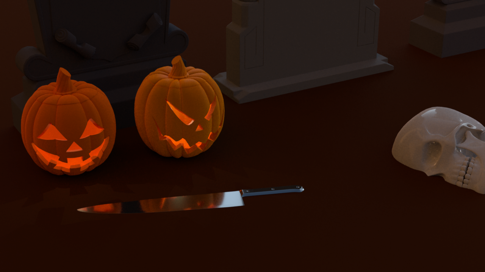

## Nori - ETHZ Rendering Competition

Ray tracing renderer implemented for a rendering competition.

Features that were implemented:

- Environment map emitter

- Disney BRDF

- Homogeneous participating media

- Depth of field

- NL means denoising
